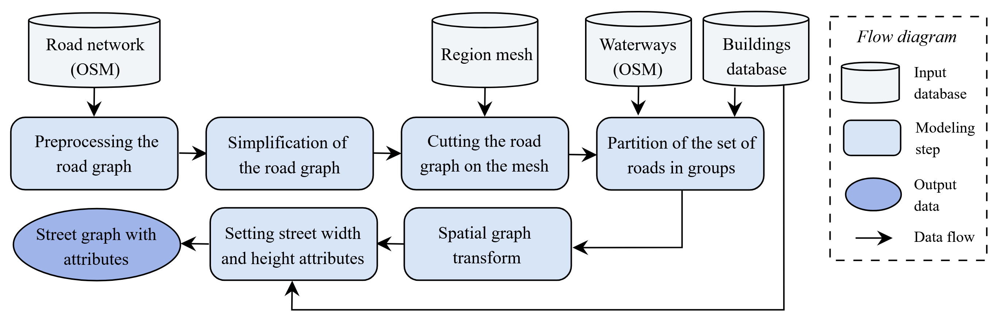

# Street network generation model

This project builds a street network with street length, width and mean building's height based on OpenStreetMap road network and a building database.  
Its original use is a street geometry preprocessor for street air quality models such as MUNICH (Kim et al. 2022). 

## Model description

## Input data
  
Mandatory input files:
+ OpenStreetMap road network: here the xml output from [eqasim](https://github.com/eqasim-org/ile-de-france) (which is based on [pt2matsim](https://github.com/matsim-org/pt2matsim))
+ Buildings: for example, in France, [BDNB](https://bdnb.io/archives\_data/bdnb\_millesime\_2022\_10\_d) database
  
Optional input file:  
+ OpenStreetMap detailed road network (with detailed geometry instead of a straight line), here the xml output from [eqasim](https://github.com/eqasim-org/ile-de-france) (which is based on [pt2matsim](https://github.com/matsim-org/pt2matsim)) with detailed option
+ Waterways: here extracted from OpenStreetMap in QGis

## Simulation

This section describes command lines to run the model. Some codes are parallelized with algo. Calculation times for Paris region (~600,000 links) are given when it takes more than a few minutes.

1 - Load data describing the urban form in `src/data/urban_form`  
* `python define_grid.py`  
* `python adjacent_cells.py` 
* `python load_BDNB.py`
* `python makeSUBbuildings.py` (1h15)  
  
2 - Load OpenStreetMap data in `src/data/load_OSM`  
* `python read_OSM.py`
* `python road_graph.py` (16h40)  
* `python road_links_neighborhood` (1h30)  
* `python makeSUBroads.py` (11h)  
* `python filter_waterways.py`  
  
3 - Build the street graph in `src/street_graph`  
* `python groups.py` (3d15h)  
* `python graph_transform.py` (1d16h)  
* `python streets_distribution.py` (10h)  
* run the following to run street_edges_height.py in parallel on each cell (1h): `python algo_generate.py` then `./algo start --computer-file=nodes_urbino.dat --argument-file=Table_of_cells_urbino.dat --log=log_urbino.txt python run_street_edges_height.py`  
* `python attributes_transform.py` (1h30)

If you already have an appropriate street network and would like to add width and height attributes to street links, you should use the following code: `src/street_graph/street_edges_height.py`  

Bibliography
> Kim, Y., Lugon, L., Maison, A., Sarica, T., Roustan, Y., Valari, M., Zhang, Y., André, M., and Sartelet, K.: MUNICH v2.0: a street-network model coupled with SSH-aerosol (v1.2) for multi-pollutant modelling, Geoscientific Model Development, 15, 7371–7396, https://doi.org/10.5194/gmd-15-7371-2022, publisher: Copernicus GmbH, 2022.
